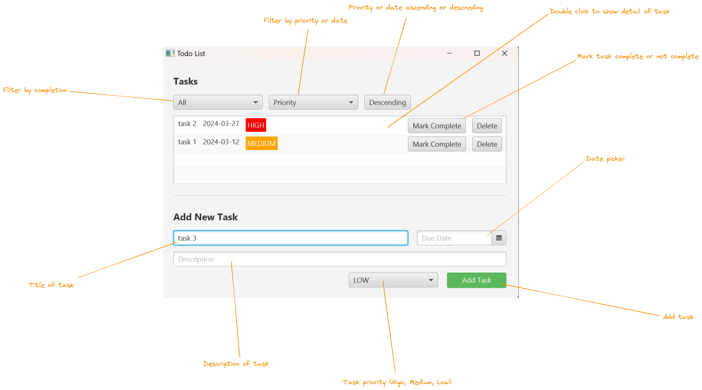

# Todo List Application
A JavaFX-based todo list application designed to boost your productivity and keep your tasks organized.

## Features
**Task Creation**: Effortlessly add new tasks with descriptions and deadlines.

**Edit Task**: Update task details and also mark tasks as complete.

**Deletion of task**: Remove tasks that are no longer relevant.

**Organization**: Prioritize tasks to maintain a clear structure. Filter and sort tasks by Date or priority or by completion status.

**Completion Tracking**: Mark tasks as complete.

**User-Friendly Interface**: Built with JavaFX.

**Saving tasks**: Tasks are saved to database and are available even after the application is closed.

## Getting Started
### Prerequisites
- Java Development Kit (JDK) version 19 or later
- Maven (build tool)

### Installation
Be sure to be in directory where is the `pom.xml` file and run the following command to build the project using Maven:

```bash
mvn clean package
```

### Running the Application
Execute the following Maven command:

```bash
mvn javafx:run
```

## Usage (Interaction with application)
### User interface
Bellow is the description of user interface of the application.

### Instructions for use
Please follow the instructions below to use the application and also with the help of the image above.
#### Adding a task:
- In the bottom of the application there is a form to add a new task.
- Fill in the task `title`, `description`, `due date`, and `priority`.
  - Note: Priority is a list of 3 options: `High, Medium, and Low`.
    - Default priority is Low.
- Click the `Add Task` button to add the task to the list.

#### Marking a task as complete:
- In the list click on the button `Mark as complete` to mark the task as complete.
- You can also unmark the task as complete by clicking on the button `Completed`.

#### Editing a task:
- Double-click on the row of the task you want to edit.
- Then popup window will appear with the details of the task.
- Edit the details of the task and click the `Save` button to save the changes.

#### Deleting a task:
- Click on the `Delete` button to delete the task.

#### Filtering and sorting tasks:
- You can filter and sort the tasks by `Date`, `Priority`, and `Completion status` using the dropdowns at the top of the application.

## Technologies
- JavaFX: Desktop UI framework
- H2 Database: Embedded database for data persistence.